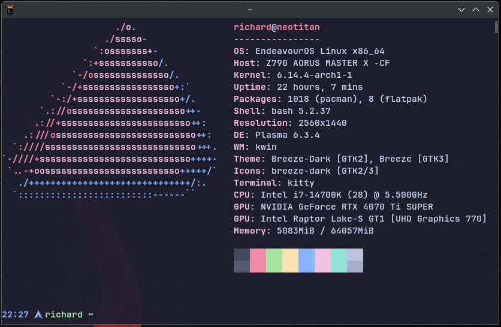

# Richard's Dotfiles


## 📦 Includes
- Starship prompt (Catppuccin Mocha theme)
- Kitty terminal configuration
- Bashrc aliases and enhancements
- Install script for symlinks and daily auto-sync
- Sync script for automatic Git sync

## 🛠 Installation
```bash
git clone git@github.com:richardbs/dotfiles.git
cd dotfiles
bash install.sh
```

## 📸 Preview
Terminal with Starship and Kitty running Catppuccin theme:



*(GIF demo coming soon!)*
